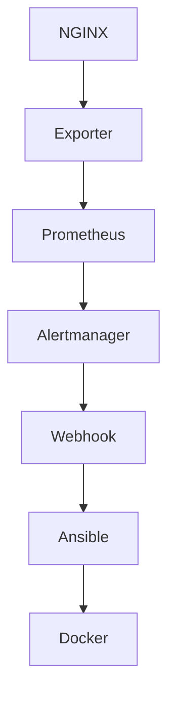

# Self-Healing Infrastructure with Prometheus, NGINX, and Docker

## 🚀 Introduction
This project demonstrates how to set up a **self-healing infrastructure** using **Prometheus**, **NGINX**, **Docker**, and **Ansible**. The system continuously monitors NGINX for any downtime and automatically restarts it when necessary. Additionally, Prometheus and Alertmanager are used for monitoring and alerting, ensuring the system's health is actively tracked.

## 🛠️ Technologies Used
- **Docker** for containerization of services.
- **Prometheus** for monitoring metrics and alerting.
- **NGINX** as the web server.
- **NGINX Prometheus Exporter** for exporting NGINX metrics.
- **Alertmanager** to handle alert notifications.
- **Ansible** for automating the self-healing process (restarting services when necessary).

## 🔧 Setup Instructions

### Prerequisites
Ensure you have the following installed:
- Docker
- Docker Compose
- Ansible (for automation)

### 📂 Project Structure
.
├── alerts/                     # Prometheus alert rules
├── config/                     # Prometheus & Alertmanager configs
├── heal-nginx.yml              # Ansible playbook for self-healing
├── webhook_listener.py         # Custom webhook listener
├── docker-compose.yml          # Service orchestration
├── logs/                       # Collected logs
└── README.md                   # This file

### Steps to Set Up

1. **Clone this repository**:

     ```
     git clone https://github.com/viqarkaif/self-healing-infra-P1-.git
     ```
    ```
     cd self-healing-infra
    ```

3. **Start the services using Docker Compose**:

    ```
    docker-compose up -d
   ```

5. **Configure Prometheus**:
   
    - Prometheus is configured to scrape metrics from the **NGINX Prometheus Exporter** at port `9113`.

6. **Set up Alertmanager**
   
    - Alerts are configured to trigger when NGINX goes down. Check the **Alertmanager UI** at `http://localhost:9093` for alert details.

8. **Self-Healing with Ansible**:
   
    - The playbook `heal-nginx.yml` is responsible for automatically restarting the NGINX and Exporter containers if they go down.


## 🧪 Testing the Self-Healing

**1. Stop NGINX container:**

      docker stop nginx
   
**2. Watch Prometheus alert fire**

**3. Observe webhook triggers Ansible**

**4. NGINX & Exporter automatically restart 🎉**

  

## 🧱 Architecture          




### 🖼️ Screenshots

### Docker starting status


### Files content


#### Prometheus Targets Page


    
### Auto Healing triggered when Nginx is stopped


### Ater Nginx Stopped ---> Prometheus Targets Page (Showing Nginx is Down)


#### Prometheus Alerting Page


### Alert Successfully Triggered


### Alert Manager Recieved the Alert Request


### Ansible Started Auto Healing by Executing the Ansible Playbook the Heal-Nginx.yml 


#### Docker Status After Nginx is Healed Successfully


### Prometheus Monitered the Nginx Status After it healed


#### Docker Compose File


### 🚨 Troubleshooting

- **NGINX is not responsive**: If NGINX is not responding, the **self-healing playbook** will automatically restart the NGINX container.
- **Exporter is down**: If the NGINX Prometheus Exporter is down, ensure that the Docker container is running. You can restart it using the Ansible playbook.

## 📚 Tools Used

1. Prometheus

2. Alertmanager

3. Ansible

4. Docker & Docker Compose

5. Python (Webhook listener)

## 🧑‍💻 Conclusion
This project ensures your infrastructure is resilient and self-healing. Using Prometheus and Alertmanager for monitoring, and Ansible for automation, this setup guarantees minimal downtime and automated recovery for critical services like NGINX.


---
## 📬 Author

.🔗 LinkedIn 

.🧑‍💻 GitHub: @viqarkaif
